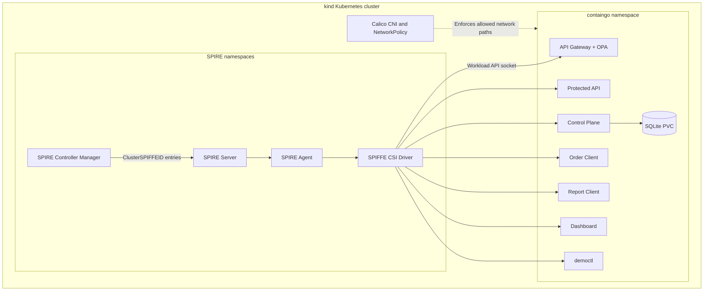
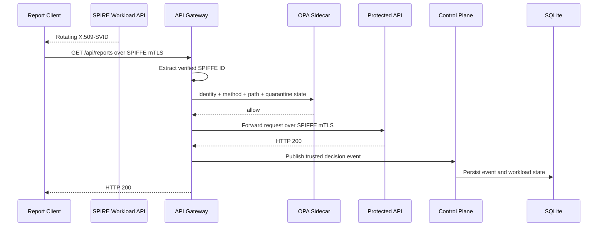
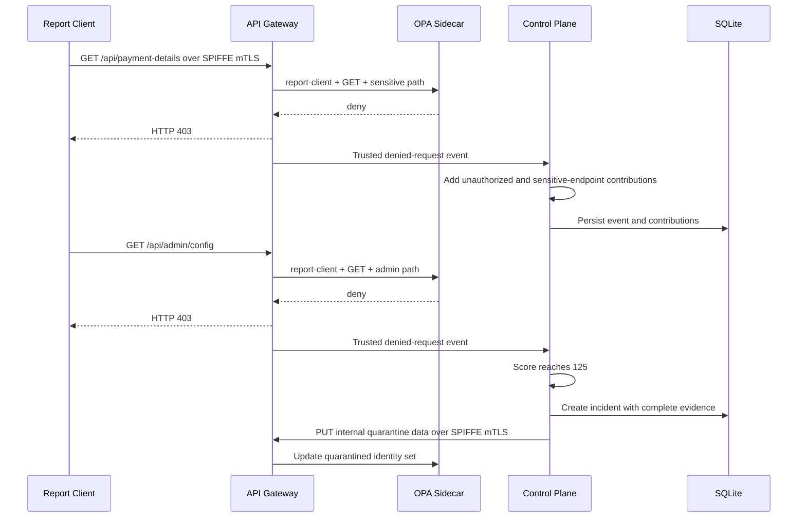
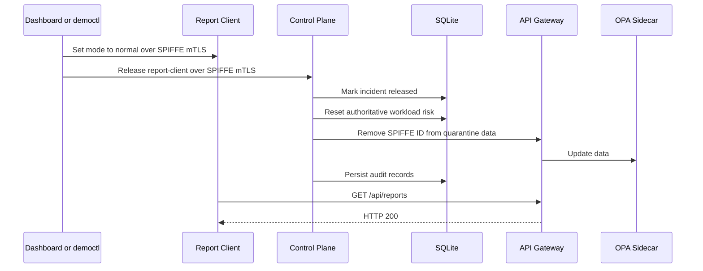

# ContainGo

**ContainGo** is a zero-trust workload quarantine platform built with **Go**, **SPIFFE/SPIRE**, **Open Policy Agent (OPA)**, **SQLite**, **Docker**, **Kubernetes**, **Calico**, and a browser-based operations dashboard.

ContainGo demonstrates how a platform can:

1. Assign cryptographically verifiable identities to workloads.
2. Authenticate service-to-service traffic with SPIFFE mutual TLS.
3. Authorize every protected request through OPA.
4. Observe trusted gateway decisions.
5. Calculate server-controlled behavioral risk.
6. Automatically quarantine a suspicious workload.
7. Preserve complete incident evidence and audit history.
8. Release the workload safely without affecting unrelated services.
9. Present the entire lifecycle through a guided UI, CLI, Postman, and automated acceptance tests.

The project is designed as a **free, local, end-to-end reference implementation** that can be demonstrated on a Windows development machine using Docker Desktop and a `kind` Kubernetes cluster.

---

## Table of contents

- [Project status](#project-status)
- [The problem ContainGo solves](#the-problem-containgo-solves)
- [Demonstrated outcome](#demonstrated-outcome)
- [Core capabilities](#core-capabilities)
- [Architecture](#architecture)
- [Runtime request flow](#runtime-request-flow)
- [Workload identity model](#workload-identity-model)
- [Authorization model](#authorization-model)
- [Risk and quarantine model](#risk-and-quarantine-model)
- [Incident evidence and auditability](#incident-evidence-and-auditability)
- [System components](#system-components)
- [Ports and internal endpoints](#ports-and-internal-endpoints)
- [Security controls](#security-controls)
- [Persistence model](#persistence-model)
- [Repository structure](#repository-structure)
- [Prerequisites](#prerequisites)
- [Validated toolchain](#validated-toolchain)
- [Quick start](#quick-start)
- [Build and test](#build-and-test)
- [Fresh Kubernetes deployment](#fresh-kubernetes-deployment)
- [Redeploying after source changes](#redeploying-after-source-changes)
- [One-command final verification](#one-command-final-verification)
- [Guided UI demonstration](#guided-ui-demonstration)
- [Postman demonstration](#postman-demonstration)
- [CLI demonstration](#cli-demonstration)
- [Automated acceptance tests](#automated-acceptance-tests)
- [SVID rotation demonstration](#svid-rotation-demonstration)
- [Recovery demonstration](#recovery-demonstration)
- [Configuration reference](#configuration-reference)
- [Operational commands](#operational-commands)
- [Troubleshooting](#troubleshooting)
- [Threat model summary](#threat-model-summary)
- [Local-demo limitations](#local-demo-limitations)
- [Productionization roadmap](#productionization-roadmap)
- [Development roadmap](#development-roadmap)
- [Contributing](#contributing)
- [License](#license)

---

## Project status

ContainGo has completed its full eleven-phase implementation roadmap.

| Phase | Scope | Status |
|---|---|---|
| 1 | Core domain models | Complete |
| 2 | SQLite persistence | Complete |
| 3 | Protected API | Complete |
| 4 | OPA authorization | Complete |
| 5 | Control Plane | Complete |
| 6 | API Gateway | Complete |
| 7 | Workload clients and `democtl` | Complete |
| 8 | Dashboard | Complete |
| 9 | SPIFFE/SPIRE integration | Complete |
| 10 | Docker and Kubernetes | Complete |
| 11 | End-to-end hardening and acceptance verification | Complete |
| Demo showcase | Guided UI and Postman facade | Complete |

The final automated verifier has demonstrated:

- seven healthy SPIFFE-enabled workloads;
- successful SPIRE identity registration;
- SQLite persistence;
- container and pod hardening;
- default-deny NetworkPolicy enforcement;
- normal authorized traffic;
- OPA-denied attack traffic;
- automatic risk-based quarantine;
- unaffected operation of an unrelated workload;
- complete incident evidence;
- authenticated release;
- risk reset;
- OPA quarantine removal;
- retained incident and audit history.

---

## The problem ContainGo solves

Traditional perimeter-based controls often answer only one question:

> Is the caller inside the network?

That is insufficient in a modern microservice platform. A compromised workload may already be inside the cluster, may possess network reachability, and may attempt to access sensitive services.

ContainGo applies a zero-trust model:

> Every workload must prove its identity, every request must be authorized, and suspicious behavior must be contained automatically.

The platform combines four complementary controls:

1. **Identity** — SPIRE issues short-lived X.509-SVIDs.
2. **Authentication** — services communicate using SPIFFE mTLS.
3. **Authorization** — OPA evaluates the authenticated identity, HTTP method, path, and quarantine state.
4. **Behavioral containment** — the Control Plane calculates risk and automatically quarantines workloads that cross the configured threshold.

ContainGo does not trust an application-supplied identity header and does not allow clients to submit their own risk points.

---

## Demonstrated outcome

The reference scenario includes two business workloads:

- `order-client`
- `report-client`

Under normal conditions:

- `order-client` may call `GET /api/orders`.
- `report-client` may call `GET /api/reports`.

When `report-client` enters attack mode, it attempts restricted endpoints:

```text
GET /api/payment-details
GET /api/admin/config
```

The result is:

```text
SPIFFE-authenticated Report Client
                ↓
API Gateway receives the request
                ↓
OPA denies the restricted route
                ↓
Gateway returns HTTP 403
                ↓
Gateway publishes a trusted decision event
                ↓
Control Plane assigns server-owned risk points
                ↓
Risk reaches 125
                ↓
Report Client is automatically quarantined
                ↓
Order Client remains active
                ↓
Administrator returns Report Client to normal mode
                ↓
Administrator releases the incident
                ↓
Risk resets and OPA quarantine data is removed
                ↓
Report Client resumes HTTP 200 traffic
```

This proves selective containment: a suspicious workload is isolated without stopping the entire application.

---

## Core capabilities

### Zero-trust workload identity

- SPIRE issues rotating X.509-SVIDs through the SPIFFE Workload API.
- No long-lived application certificate files are mounted.
- Every executable verifies that the issued SPIFFE ID matches the identity expected for that component.
- Internal TLS peers are matched against exact allowed SPIFFE IDs.

### OPA authorization

- The API Gateway delegates request authorization to an OPA sidecar.
- Policy input includes:
  - authenticated SPIFFE ID;
  - HTTP method;
  - request path;
  - current quarantine data.
- Quarantine overrides normal route permission.
- OPA policy tests are included in the repository.

### Behavioral risk scoring

- Risk contributions are generated by trusted server code.
- Clients cannot specify rule names or point values.
- Repeated suspicious activity accumulates within the current risk cycle.
- Risk state is persisted in SQLite.
- The default quarantine threshold is `70`.

### Automatic quarantine

- The Control Plane creates an incident when the score reaches the threshold.
- The quarantined SPIFFE ID is synchronized to the API Gateway's OPA data.
- Future requests from the identity are denied.
- Other workload identities continue operating.

### Complete evidence

- Every new incident stores the complete set of current-cycle risk contributions.
- Stored incident-reason points equal `score_at_quarantine`.
- Events, incidents, reasons, and administrative actions remain queryable.

### Authenticated administration

- `democtl` and the Dashboard use their own SPIFFE identities.
- Administrative release and reset operations are not anonymous.
- Audit records preserve:
  - actor identity;
  - action;
  - target workload;
  - supporting details;
  - timestamp.

### Guided demonstration

- Dashboard overview
- Guided `/demo` console
- `/architecture` presentation page
- Live request counters and risk state
- OPA decision history
- Incident evidence
- Audit history
- One-click reset and safe release
- Token-protected Postman facade

### Automated validation

- Go unit tests
- Go integration tests
- `go vet`
- executable builds
- OPA policy tests
- Kubernetes rollout checks
- SPIRE registration checks
- pod and container hardening checks
- NetworkPolicy allow/deny checks
- end-to-end quarantine and release checks
- optional recovery testing
- optional SVID rotation verification

---

## Architecture

### High-level architecture

```mermaid
flowchart LR
    OC[Order Client] -->|SPIFFE mTLS| GW[API Gateway]
    RC[Report Client] -->|SPIFFE mTLS| GW
    CP[Control Plane] -->|SPIFFE mTLS: quarantine sync| GW

    GW --> OPA[OPA Sidecar]
    GW -->|SPIFFE mTLS| PA[Protected API]
    GW -->|Trusted security events over SPIFFE mTLS| CP

    CP --> DB[(SQLite)]

    D[Dashboard] -->|SPIFFE mTLS| CP
    D -->|SPIFFE mTLS: demo control| RC

    CLI[democtl] -->|SPIFFE mTLS| CP
    CLI -->|SPIFFE mTLS: mode control| RC

    P[Postman on localhost] -->|Local token through port-forward| D

    SPIRE[SPIRE Workload API] -. Rotating X.509-SVIDs .-> OC
    SPIRE -.-> RC
    SPIRE -.-> GW
    SPIRE -.-> PA
    SPIRE -.-> CP
    SPIRE -.-> D
    SPIRE -.-> CLI
```

### Kubernetes platform



---

## Runtime request flow

### Normal authorized request



### Denied attack request and quarantine



### Release lifecycle



---

## Workload identity model

ContainGo uses the trust domain:

```text
containgo.local
```

SPIFFE IDs are derived from Kubernetes namespace and ServiceAccount:

```text
spiffe://containgo.local/ns/containgo/sa/<service-account>
```

Registered identities:

| Workload | SPIFFE ID |
|---|---|
| API Gateway | `spiffe://containgo.local/ns/containgo/sa/api-gateway` |
| Protected API | `spiffe://containgo.local/ns/containgo/sa/protected-api` |
| Control Plane | `spiffe://containgo.local/ns/containgo/sa/control-plane` |
| Order Client | `spiffe://containgo.local/ns/containgo/sa/order-client` |
| Report Client | `spiffe://containgo.local/ns/containgo/sa/report-client` |
| Dashboard | `spiffe://containgo.local/ns/containgo/sa/dashboard` |
| democtl | `spiffe://containgo.local/ns/containgo/sa/democtl` |

The `ClusterSPIFFEID` resource selects:

- namespace: `containgo`;
- pods labelled `containgo.io/spiffe: "true"`;
- identity template based on namespace and ServiceAccount;
- X.509-SVID TTL: `30m`.

Each application receives the Workload API socket through the SPIFFE CSI driver:

```yaml
env:
  - name: SPIFFE_ENDPOINT_SOCKET
    value: unix:///spiffe-workload-api/spire-agent.sock

volumeMounts:
  - name: spiffe-workload-api
    mountPath: /spiffe-workload-api
    readOnly: true

volumes:
  - name: spiffe-workload-api
    csi:
      driver: csi.spiffe.io
      readOnly: true
```

Applications log the initial SVID and later rotations:

```text
loaded SPIFFE identity=... serial=... valid_until=...
rotated SPIFFE identity=... serial=... valid_until=...
```

---

## Authorization model

### Service-to-service peer authorization

| Caller | Destination | Purpose |
|---|---|---|
| `order-client` | API Gateway | Business request to `/api/orders` |
| `report-client` | API Gateway | Business request to `/api/reports` and demo attack requests |
| `control-plane` | API Gateway | Synchronize quarantine data |
| API Gateway | Protected API | Forward allowed business requests |
| API Gateway | Control Plane | Publish trusted decision events |
| Dashboard | Control Plane | Read state and perform administrative actions |
| Dashboard | Report Client | Guided-demo mode and counter control |
| `democtl` | Control Plane | Read state, release, and reset risk |
| `democtl` | Report Client | Change demo mode |

Important restrictions:

- Protected API accepts only the API Gateway SPIFFE ID.
- Event ingestion accepts only the API Gateway SPIFFE ID.
- Gateway quarantine updates accept only the Control Plane SPIFFE ID.
- Report Client control accepts only Dashboard and `democtl`.
- Application-supplied identity headers are ignored and are not part of the production identity path.

### OPA business-route authorization

| Authenticated identity | Method | Path | Decision |
|---|---:|---|---|
| Order Client | `GET` | `/api/orders` | Allow |
| Order Client | `GET` | `/api/reports` | Deny |
| Report Client | `GET` | `/api/reports` | Allow |
| Report Client | `GET` | `/api/orders` | Deny |
| Report Client | `GET` | `/api/payment-details` | Deny |
| Report Client | `GET` | `/api/admin/config` | Deny |
| Any workload | Non-`GET` business request | Protected route | Deny |
| Quarantined workload | Any normally allowed route | Any | Deny |

OPA policy tests verify these rules automatically.

---

## Risk and quarantine model

The Control Plane owns the risk rules and point values.

| Rule | Points | Meaning |
|---|---:|---|
| `unauthorized_endpoint` | 25 | Workload attempted a route not permitted for its identity |
| `highly_sensitive_endpoint_attempt` | 40 | Workload attempted `/api/payment-details` |
| `administrative_endpoint_attempt` | 35 | Workload attempted `/api/admin/config` |
| Request-rate anomaly | 20 | More than 30 requests are observed inside the configured rolling 60-second window |

Default quarantine threshold:

```text
70
```

Standard attack evidence:

```text
unauthorized_endpoint              25
highly_sensitive_endpoint_attempt  40
unauthorized_endpoint              25
administrative_endpoint_attempt    35
                                    --
                                   125
```

A score of `125` exceeds the threshold, so the Report Client is quarantined.

### Risk-cycle behavior

- Contributions accumulate during the current risk cycle.
- An active workload can have a nonzero score below the threshold.
- Quarantine creates an incident.
- Release resets:
  - risk score;
  - denied-request count;
  - quarantine timestamp;
  - OPA quarantine data.
- Historical events, incidents, reasons, and audit records remain stored.
- Explicit `reset-risk` is allowed only for an active workload.

---

## Incident evidence and auditability

ContainGo reconstructs complete current-cycle evidence before creating an incident.

The algorithm reads persisted events newest-first and selects the newest contribution suffix whose total equals the current workload score. It then stores those reasons chronologically.

This ensures:

```text
sum(incident reason points) == incident.score_at_quarantine
```

Administrative actions create audit records such as:

```text
incident_released
workload_released
opa_quarantine_removed
```

Each record includes:

- authenticated actor SPIFFE ID;
- target workload SPIFFE ID;
- action name;
- structured details;
- timestamp.

---

## System components

| Component | Responsibility |
|---|---|
| `api-gateway` | SPIFFE mTLS entry point, identity extraction, OPA authorization, reverse proxying, trusted event publication, quarantine-data endpoint |
| OPA sidecar | Evaluates identity, method, path, and quarantine data |
| `protected-api` | Exposes protected business endpoints and accepts only API Gateway identity |
| `control-plane` | Persists events, calculates risk, creates incidents, synchronizes quarantine, exposes administration API |
| `order-client` | Continuously exercises the allowed orders route |
| `report-client` | Exercises normal, rapid, attack, and paused modes |
| `dashboard` | Browser UI, guided demo, architecture view, evidence and audit display |
| `democtl` | SPIFFE-authenticated CLI for status, mode, release, reset, and inspection |
| SPIRE | Issues and rotates workload identities |
| Calico | Provides the CNI and enforces NetworkPolicies |
| SQLite | Stores workload state, events, contributions, incidents, reasons, and audit records |
| Postman facade | Local, token-protected demo API hosted by Dashboard; backend calls remain SPIFFE mTLS |

---

## Ports and internal endpoints

| Component | Port | Protocol | Exposure |
|---|---:|---|---|
| Dashboard | `8060` | HTTP | ClusterIP; accessed through localhost `kubectl port-forward` |
| Report Client control API | `8072` | HTTPS with SPIFFE mTLS | Cluster-internal |
| Protected API | `8080` | HTTPS with SPIFFE mTLS | Cluster-internal |
| Control Plane | `8090` | HTTPS with SPIFFE mTLS | Cluster-internal |
| OPA sidecar | `8181` | HTTP | Inside API Gateway pod |
| API Gateway | `8443` | HTTPS with SPIFFE mTLS | Cluster-internal |

Business endpoints:

```text
GET /api/orders
GET /api/reports
GET /api/customers
GET /api/payment-details
GET /api/admin/config
```

Dashboard routes:

```text
GET  /
GET  /demo
GET  /architecture
GET  /audit
GET  /workloads/{name}
POST /workloads/{name}/release
POST /workloads/{name}/reset-risk
GET  /healthz
GET  /readyz
```

Local Postman facade:

```text
GET  /demo-api/v1/state
POST /demo-api/v1/mode
POST /demo-api/v1/release
POST /demo-api/v1/reset
GET  /demo-api/v1/workloads
GET  /demo-api/v1/report-client/evidence
```

Every Postman facade request must include:

```text
X-ContainGo-Demo-Token: {{demo_token}}
```

---

## Security controls

### Identity and transport

- SPIRE-issued short-lived X.509-SVIDs
- Automatic SVID and trust-bundle refresh
- Exact peer SPIFFE-ID matching
- TLS 1.2 or newer through Go defaults and explicit TLS configuration
- HTTP/2 enabled on custom Go transports where appropriate
- No production identity-header fallback
- No static workload private keys

### Authorization

- OPA decision point at the API Gateway
- deny-by-default route policy
- quarantine override
- exact administrative identities
- exact event-ingestion identity
- server-owned risk rules and points

### Kubernetes security

Application pods use:

```yaml
automountServiceAccountToken: false

securityContext:
  runAsNonRoot: true
  runAsUser: 65532
  runAsGroup: 65532
  seccompProfile:
    type: RuntimeDefault
```

Application containers use:

```yaml
securityContext:
  allowPrivilegeEscalation: false
  readOnlyRootFilesystem: true
  capabilities:
    drop:
      - ALL
```

Additional controls:

- CPU and memory requests and limits
- startup, liveness, and readiness probes
- graceful shutdown
- default-deny NetworkPolicy
- explicit ingress and egress rules
- Dashboard exposed only through localhost port-forward
- randomized Postman demo token stored in Kubernetes Secret

### Network isolation

NetworkPolicies ensure:

- clients can reach only the API Gateway;
- API Gateway can reach Protected API and Control Plane;
- Control Plane can reach API Gateway;
- Dashboard can reach Control Plane and Report Client control;
- `democtl` can reach Control Plane and Report Client control;
- direct `democtl → Protected API` access is blocked;
- DNS access is explicitly allowed;
- unspecified traffic is denied.

---

## Persistence model

ContainGo uses SQLite for the local reference deployment.

Conceptual data areas:

| Data | Purpose |
|---|---|
| Workloads | Registered name, SPIFFE ID, current status, score, denied count, timestamps |
| Security events | Trusted gateway decision event and request metadata |
| Risk contributions | Rule, points, reason, event relationship |
| Incidents | Open or released quarantine incident |
| Incident reasons | Complete evidence captured at quarantine |
| Audit records | Authenticated administrative and synchronization actions |

The Kubernetes deployment uses a single ReadWriteOnce hostPath-backed PersistentVolume suitable for a one-node `kind` demo.

SQLite files are runtime artifacts and must not be committed to Git.

---

## Repository structure

```text
.
├── .github/
│   └── workflows/
│       └── ci.yml
├── build/
│   └── docker/
│       ├── Dockerfile.api-gateway
│       ├── Dockerfile.control-plane
│       ├── Dockerfile.dashboard
│       ├── Dockerfile.democtl
│       ├── Dockerfile.order-client
│       ├── Dockerfile.protected-api
│       └── Dockerfile.report-client
├── cmd/
│   ├── api-gateway/
│   ├── control-plane/
│   ├── dashboard/
│   ├── democtl/
│   ├── order-client/
│   ├── protected-api/
│   └── report-client/
├── deploy/
│   ├── calico/
│   ├── kind/
│   ├── kubernetes/
│   └── spire/
├── docs/
│   ├── architecture.md
│   ├── final-demo.md
│   ├── threat-model.md
│   └── ui-postman-demo.md
├── internal/
│   ├── apigateway/
│   ├── application/
│   ├── config/
│   ├── controlplane/
│   ├── dashboard/
│   ├── database/
│   ├── domain/
│   ├── gateway/
│   ├── opa/
│   ├── protectedapi/
│   ├── reportclient/
│   ├── repository/
│   ├── risk/
│   ├── testutil/
│   ├── workloadclient/
│   └── workloadidentity/
├── migrations/
├── policies/
│   ├── containgo.rego
│   └── containgo_test.rego
├── postman/
│   ├── ContainGo.postman_collection.json
│   └── ContainGo.local.postman_environment.json
├── scripts/
│   ├── build-kind-images.ps1
│   ├── check-containgo.ps1
│   ├── create-kind-cluster.ps1
│   ├── democtl-k8s.ps1
│   ├── deploy-containgo.ps1
│   ├── export-postman-environment.ps1
│   ├── install-calico.ps1
│   ├── install-spire.ps1
│   ├── phase10-down.ps1
│   ├── phase10-logs.ps1
│   ├── phase10-prereqs.ps1
│   ├── phase10-up.ps1
│   ├── phase11-complete.ps1
│   ├── phase11-static-checks.ps1
│   ├── phase11-verify.ps1
│   ├── port-forward-dashboard.ps1
│   ├── show-demo-access.ps1
│   ├── start-demo-showcase.ps1
│   ├── test-opa-policy.ps1
│   └── watch-svid-rotation.ps1
├── .dockerignore
├── .gitignore
├── go.mod
├── go.sum
└── README.md
```

### Important package responsibilities

| Package | Purpose |
|---|---|
| `internal/domain` | Workload, event, contribution, incident, audit, and SPIFFE constants |
| `internal/risk` | Rule classification, rolling request windows, and risk calculation |
| `internal/repository` | SQLite persistence and transaction boundaries |
| `internal/controlplane` | Event ingestion, risk lifecycle, quarantine, release, and administration |
| `internal/apigateway` | TLS server, peer identity, OPA decision, reverse proxy, trusted event publication |
| `internal/workloadidentity` | SPIFFE Workload API source and TLS configuration |
| `internal/workloadclient` | Shared workload HTTP client behavior |
| `internal/reportclient` | Demo modes, request runner, counters, and control API |
| `internal/dashboard` | Dashboard client, handlers, templates, guided demo, and Postman facade |

---

## Prerequisites

The reference workflow is optimized for Windows PowerShell.

Required:

- Windows 10 or Windows 11
- PowerShell 7 recommended
- Docker Desktop running Linux containers
- WSL2 backend enabled for Docker Desktop
- Go
- `kind`
- `kubectl`
- Helm
- Git
- Postman for the API demonstration
- A modern browser

Commands must be available on `PATH`:

```text
docker
kind
kubectl
helm
go
git
```

Check prerequisites:

```powershell
Set-Location C:\Projects\containGo

.\scripts\phase10-prereqs.ps1
```

---

## Validated toolchain

The project has been exercised successfully with the following local stack:

| Tool | Validated version |
|---|---|
| Docker client/server | `29.1.3` |
| kind | `0.32.0` |
| kubectl client | `1.34.1` |
| Helm | `4.2.2` |
| Kubernetes node image | `kindest/node:v1.36.1` |
| Go builder image | `golang:1.25-bookworm` |
| OPA image | `openpolicyagent/opa:1.17.1-static` |
| SPIRE chart | `0.29.0` |
| SPIRE CRD chart | `0.5.0` |
| Calico | `3.32.0` |

Other compatible versions may work, but the commands and troubleshooting notes in this README reflect the validated environment.

---

## Quick start

### Clone the repository

```powershell
git clone <repository-url>
Set-Location .\containGo
```

Replace `<repository-url>` with the actual Git remote.

### Run the complete build, deployment, and verification

For an existing `containgo` cluster:

```powershell
.\scripts\phase11-complete.ps1 `
    -ClusterName containgo
```

For a completely fresh local cluster, first create the cluster:

```powershell
.\scripts\phase10-up.ps1 `
    -RecreateCluster
```

Then apply the latest source and verification:

```powershell
.\scripts\phase11-complete.ps1 `
    -ClusterName containgo
```

A successful final run ends with:

```text
ContainGo Phase 11 verification PASSED
ContainGo Phase 11 completed successfully.
```

---

## Build and test

### Format

```powershell
gofmt -w .
```

### Download and reconcile modules

```powershell
go mod tidy
```

### Run all Go tests

```powershell
go test ./...
```

Run without test caching:

```powershell
go test -count=1 ./...
```

Run race-enabled tests:

```powershell
go test -race ./...
```

### Static analysis

```powershell
go vet ./...
```

### Build every executable

```powershell
go build `
    ./cmd/protected-api `
    ./cmd/api-gateway `
    ./cmd/control-plane `
    ./cmd/order-client `
    ./cmd/report-client `
    ./cmd/dashboard `
    ./cmd/democtl
```

### Run the consolidated static-check script

```powershell
.\scripts\phase11-static-checks.ps1
```

Race-enabled:

```powershell
.\scripts\phase11-static-checks.ps1 -Race
```

### Test OPA policy

```powershell
.\scripts\test-opa-policy.ps1
```

Expected:

```text
PASS: 6/6
OPA policy tests passed.
```

---

## Fresh Kubernetes deployment

### Create the cluster and install the platform

```powershell
.\scripts\phase10-up.ps1 `
    -RecreateCluster
```

The process:

```text
Validate prerequisites
        ↓
Create kind cluster without default CNI
        ↓
Install Calico
        ↓
Build and load ContainGo images
        ↓
Install SPIRE CRDs and SPIRE
        ↓
Apply ClusterSPIFFEID
        ↓
Create storage and application resources
        ↓
Restart Deployments in dependency order
        ↓
Wait for readiness
```

### Inspect the environment

```powershell
.\scripts\check-containgo.ps1 `
    -ClusterName containgo
```

Expected application state:

```text
api-gateway     2/2 Running
control-plane   1/1 Running
dashboard       1/1 Running
democtl         1/1 Running
order-client    1/1 Running
protected-api   1/1 Running
report-client   1/1 Running
```

---

## Redeploying after source changes

Rebuild and load all images:

```powershell
.\scripts\build-kind-images.ps1 `
    -ClusterName containgo
```

Redeploy:

```powershell
.\scripts\deploy-containgo.ps1 `
    -ClusterName containgo `
    -TimeoutSeconds 900
```

The deployment script restarts components in dependency order:

```text
Protected API
    ↓
API Gateway
    ↓
Control Plane
    ↓
Order Client
    ↓
Report Client
    ↓
Dashboard
    ↓
democtl
```

This order prevents the API Gateway and Control Plane from creating a circular startup dependency.

---

## One-command final verification

```powershell
.\scripts\phase11-complete.ps1 `
    -ClusterName containgo
```

The command runs:

1. Go formatting check
2. Go tests
3. `go vet`
4. seven executable builds
5. OPA policy tests
6. seven Docker image builds
7. image loading into `kind`
8. SPIRE installation or upgrade
9. Kubernetes deployment
10. end-to-end acceptance verification

Useful options:

```text
-SkipStaticChecks
-SkipImageBuild
-SkipNetworkIsolation
-ExerciseRecovery
-DeployTimeoutSeconds 900
-VerifyTimeoutSeconds 300
```

Example with recovery validation:

```powershell
.\scripts\phase11-complete.ps1 `
    -ClusterName containgo `
    -ExerciseRecovery
```

---

## Guided UI demonstration

### Start the showcase

```powershell
.\scripts\start-demo-showcase.ps1 `
    -ClusterName containgo `
    -OpenBrowser
```

The script:

1. reads the random Kubernetes demo token;
2. generates a local Postman environment;
3. prints access details;
4. opens the guided UI;
5. starts the blocking Dashboard port-forward.

Keep the terminal running.

URLs:

```text
Overview:      http://127.0.0.1:8060/
Demo Console:  http://127.0.0.1:8060/demo
Architecture:  http://127.0.0.1:8060/architecture
Audit:         http://127.0.0.1:8060/audit
```

### Recommended presenter flow

#### 1. Architecture

Open `/architecture`.

Explain:

```text
SPIRE identity
    → SPIFFE mTLS
    → API Gateway
    → OPA policy
    → Protected API
    → trusted event
    → Control Plane
    → risk and quarantine
    → SQLite evidence
```

Show all seven workload identities and the security-control summary.

#### 2. Reset

Open `/demo` and click **Reset demo**.

Confirm:

```text
Mode: normal
Report Client: active
Risk: 0
Forbidden: 0
Failures: 0
Last path: /api/reports
Last status: 200
```

#### 3. Normal flow

Leave mode on **Normal**.

Point out:

- authenticated Report Client identity;
- allowed `/api/reports` route;
- HTTP 200;
- persisted event;
- Order Client and Report Client both active.

#### 4. Rapid anomaly

Click **Rapid burst**.

Explain that the route remains authorized, but the volume is anomalous. The risk engine can therefore detect behavior that pure route authorization cannot detect.

Return to **Normal**.

#### 5. Attack

Click **Attack**.

Show:

- attempts to `/api/payment-details`;
- attempts to `/api/admin/config`;
- HTTP 403;
- OPA deny;
- risk reaching 125;
- automatic quarantine;
- Order Client remaining active.

#### 6. Evidence

Show the incident:

```text
25 + 40 + 25 + 35 = 125
```

The reason total must equal the quarantine score.

#### 7. Release

Click **Release quarantined workload**.

Show:

- mode changed to normal;
- incident released;
- workload reactivated;
- risk reset;
- OPA quarantine removed;
- `/api/reports` returns 200 again;
- incident and audit history retained.

---

## Postman demonstration

### Generate the local environment

Keep the Dashboard port-forward active.

```powershell
.\scripts\export-postman-environment.ps1 `
    -ClusterName containgo
```

Generated file:

```text
postman\ContainGo.local.generated.postman_environment.json
```

This file contains a local demo token and must not be committed.

### Import into Postman

Import:

```text
postman\ContainGo.postman_collection.json
postman\ContainGo.local.generated.postman_environment.json
```

Select:

```text
ContainGo Local Demo
```

### Run the collection in order

```text
00 - Reset Demo
01 - View Normal State
02 - Trigger Rapid Burst
03 - Return to Normal
04 - Start Attack
05 - Observe Automatic Quarantine
06 - Inspect Complete Evidence
07 - Release and Recover
08 - Verify Normal Traffic Resumes
09 - List All Workloads
```

### Postman security model

Postman is not given a SPIFFE private key.

```text
Postman
    ↓ localhost request with random demo token
Dashboard facade
    ↓ Dashboard's rotating SPIFFE X.509-SVID
Control Plane and Report Client
```

This preserves the workload identity design while providing a practical demonstration interface.

---

## CLI demonstration

Show status:

```powershell
.\scripts\democtl-k8s.ps1 status
```

Machine-readable status:

```powershell
.\scripts\democtl-k8s.ps1 status-json
```

Start attack:

```powershell
.\scripts\democtl-k8s.ps1 attack
Start-Sleep -Seconds 10
.\scripts\democtl-k8s.ps1 status
```

Inspect complete evidence:

```powershell
.\scripts\democtl-k8s.ps1 `
    inspect-json `
    report-client
```

Return to normal and release:

```powershell
.\scripts\democtl-k8s.ps1 normal

.\scripts\democtl-k8s.ps1 `
    release `
    report-client

Start-Sleep -Seconds 5

.\scripts\democtl-k8s.ps1 status
```

Other commands:

```text
status
status-json
inspect-json <workload>
normal
rapid
attack
pause
release <workload>
reset-risk <workload>
```

---

## Automated acceptance tests

Run against an already deployed cluster:

```powershell
.\scripts\phase11-verify.ps1 `
    -ClusterName containgo `
    -TimeoutSeconds 300
```

The verifier checks:

1. seven successful Kubernetes rollouts;
2. pod readiness and restart state;
3. SQLite PVC bound;
4. SPIRE convergence to seven entries;
5. zero SPIRE registration failures;
6. ServiceAccount token automount disabled;
7. non-root pod security context;
8. RuntimeDefault seccomp;
9. SPIFFE CSI socket mounted;
10. no privilege escalation;
11. read-only root filesystems;
12. all Linux capabilities dropped;
13. required NetworkPolicies;
14. allowed network paths;
15. blocked direct path;
16. normal Report Client traffic;
17. zero normal transport failures;
18. OPA-denied attack traffic;
19. automatic quarantine;
20. Order Client unaffected;
21. complete incident evidence;
22. authenticated release;
23. risk reset;
24. OPA quarantine removal;
25. normal traffic recovery;
26. retained incident and audit records.

Expected final output:

```text
ContainGo Phase 11 verification PASSED
```

---

## SVID rotation demonstration

```powershell
.\scripts\watch-svid-rotation.ps1 `
    -Component api-gateway `
    -ClusterName containgo `
    -TimeoutSeconds 1800
```

The script watches the workload logs until the certificate serial number changes without restarting the workload.

Expected:

```text
SVID rotation verified.
Previous serial: ...
New serial:      ...
```

---

## Recovery demonstration

Run the acceptance verifier with controlled restarts:

```powershell
.\scripts\phase11-verify.ps1 `
    -ClusterName containgo `
    -TimeoutSeconds 300 `
    -ExerciseRecovery
```

This restarts the API Gateway and Control Plane in dependency order and confirms that normal traffic recovers.

---

## Configuration reference

### Shared identity setting

| Variable | Purpose |
|---|---|
| `SPIFFE_ENDPOINT_SOCKET` | SPIFFE Workload API socket |

Kubernetes value:

```text
unix:///spiffe-workload-api/spire-agent.sock
```

### API Gateway

| Variable | Purpose |
|---|---|
| `CONTAINGO_GATEWAY_ADDRESS` | Gateway listen address |
| `CONTAINGO_OPA_URL` | OPA decision service |
| `CONTAINGO_PROTECTED_API_URL` | Protected API upstream |
| `CONTAINGO_CONTROL_PLANE_URL` | Trusted event destination |

### Protected API

| Variable | Purpose |
|---|---|
| `CONTAINGO_PROTECTED_API_ADDRESS` | Protected API listen address |

### Control Plane

| Variable | Purpose |
|---|---|
| `CONTAINGO_CONTROL_PLANE_ADDRESS` | Control Plane listen address |
| `CONTAINGO_DATABASE_PATH` | SQLite file location |
| `CONTAINGO_ENFORCEMENT_MODE` | Quarantine enforcement implementation |
| `CONTAINGO_GATEWAY_URL` | Gateway internal quarantine endpoint |

### Order Client

| Variable | Purpose |
|---|---|
| `CONTAINGO_GATEWAY_URL` | API Gateway base URL |
| `CONTAINGO_ORDER_INTERVAL` | Polling interval |
| `CONTAINGO_ORDER_REQUEST_TIMEOUT` | HTTP request timeout |

### Report Client

| Variable | Purpose |
|---|---|
| `CONTAINGO_GATEWAY_URL` | API Gateway base URL |
| `CONTAINGO_REPORT_INITIAL_MODE` | Initial `normal`, `rapid`, `attack`, or `paused` mode |
| `CONTAINGO_REPORT_CONTROL_ADDRESS` | SPIFFE mTLS control API address |
| `CONTAINGO_REPORT_NORMAL_INTERVAL` | Normal request interval |
| `CONTAINGO_REPORT_ATTACK_INTERVAL` | Attack cycle interval |
| `CONTAINGO_REPORT_RAPID_INTERVAL` | Delay between rapid bursts |
| `CONTAINGO_REPORT_RAPID_BURST` | Requests per rapid burst |
| `CONTAINGO_REPORT_REQUEST_TIMEOUT` | Request timeout |

### Dashboard

| Variable | Purpose |
|---|---|
| `CONTAINGO_DASHBOARD_ADDRESS` | Dashboard listen address |
| `CONTAINGO_CONTROL_PLANE_URL` | SPIFFE mTLS Control Plane URL |
| `CONTAINGO_REPORT_CLIENT_CONTROL_URL` | SPIFFE mTLS Report Client control URL |
| `CONTAINGO_DASHBOARD_API_TIMEOUT` | Backend request timeout |
| `CONTAINGO_DASHBOARD_SECURE_COOKIE` | Secure flag for browser cookie |
| `CONTAINGO_DEMO_API_TOKEN` | Random token protecting the local Postman facade |

### democtl

| Variable | Purpose |
|---|---|
| `CONTAINGO_CONTROL_PLANE_URL` | SPIFFE mTLS Control Plane URL |
| `CONTAINGO_REPORT_CLIENT_CONTROL_URL` | SPIFFE mTLS Report Client control URL |

---

## Operational commands

### View pods

```powershell
kubectl `
    --context kind-containgo `
    --namespace containgo `
    get pods `
    -o wide
```

### View services

```powershell
kubectl `
    --context kind-containgo `
    --namespace containgo `
    get services
```

### View all workloads

```powershell
.\scripts\democtl-k8s.ps1 status
```

### View component logs

```powershell
.\scripts\phase10-logs.ps1 `
    -Component api-gateway `
    -Follow
```

Components:

```text
api-gateway
protected-api
control-plane
order-client
report-client
dashboard
democtl
```

### Check SPIRE

```powershell
.\scripts\check-spire.ps1 `
    -KubeContext kind-containgo
```

### Check ClusterSPIFFEID

```powershell
kubectl `
    --context kind-containgo `
    get clusterspiffeid/containgo-workloads `
    -o yaml
```

### Open Dashboard manually

```powershell
.\scripts\port-forward-dashboard.ps1 `
    -ClusterName containgo
```

### Stop and remove the cluster

```powershell
.\scripts\phase10-down.ps1 `
    -ClusterName containgo
```

Deleting the `kind` cluster also removes the local hostPath demonstration database.

---

## Troubleshooting

### Calico reports `no matching resources found`

Cause:

- The installer checked `TigeraStatus` before the operator created the resources.

Resolution:

- wait for the Tigera Operator;
- poll until `TigeraStatus` resources exist;
- then wait for `Available=True`;
- reuse an already healthy installation.

Check:

```powershell
kubectl --context kind-containgo get tigerastatus
kubectl --context kind-containgo get nodes
```

Expected:

```text
calico      True False False
apiserver   True False False
node        Ready
```

### Helm reports a Calico field-ownership conflict

Cause:

- Helm attempted to upgrade an already healthy operator-managed `Installation` resource.

Resolution:

- skip Calico Helm upgrade when all `TigeraStatus` objects and nodes are healthy;
- do not force ownership unnecessarily.

### `spire-crds` chart version not found

Cause:

- The CRD chart and main SPIRE chart were given the same version.

Correct versions in this project:

```text
spire-crds: 0.5.0
spire:      0.29.0
```

### SPIRE readiness says no pods exist in namespace `spire`

Cause:

- The hardened chart uses separate runtime namespaces.

Check:

```powershell
kubectl --context kind-containgo -n spire-server get pods
kubectl --context kind-containgo -n spire-system get pods
```

The installer must wait for:

```text
spire-server
spire-system
```

### OPA sidecar enters `CrashLoopBackOff` with exit code 0

Cause:

- OPA listened only on `127.0.0.1`, while Kubernetes probes used the pod IP.

Required argument:

```text
--addr=0.0.0.0:8181
```

The API Gateway can still call OPA through `http://127.0.0.1:8181` because containers in the same pod share the network namespace.

### API Gateway rollout waits indefinitely

Cause:

- Kubernetes readiness used `/readyz`, which depended on Control Plane availability.
- The Control Plane depended on the Gateway Service, creating a cycle.

Resolution:

- Kubernetes readiness uses `/healthz`.
- `/readyz` remains available for diagnostics but does not control Service membership.

### Control Plane startup reconciliation times out

Check:

1. API Gateway is `2/2 Running`.
2. OPA sidecar is healthy.
3. API Gateway Service has endpoints.
4. Control Plane NetworkPolicy allows Gateway access.

Restart after the Gateway is ready:

```powershell
kubectl `
    --context kind-containgo `
    --namespace containgo `
    rollout restart deployment/control-plane
```

### SPIRE verifier temporarily sees more than seven entries

Cause:

- A rolling update temporarily leaves an old pod terminating while the new pod is running.

Resolution:

- wait for the old pod to terminate;
- retry until:
  - `entriesToSet = 7`;
  - `podsSelected = 7`;
  - failures are zero.

### Dashboard demo Secret check fails with `NotFound`

The deployment script must use:

```powershell
kubectl get secret containgo-demo-api --ignore-not-found
```

An empty result means the script should create the Secret.

### Report Client shows many historical failures

The in-memory counters may include failures from an earlier period when the Gateway was unavailable.

Reset through the guided UI, or restart:

```powershell
kubectl `
    --context kind-containgo `
    --namespace containgo `
    rollout restart deployment/report-client
```

### Postman receives `401 Unauthorized`

Check:

1. Dashboard port-forward is running.
2. The generated environment is selected.
3. The request includes `X-ContainGo-Demo-Token`.
4. Regenerate the environment after the Secret changes:

```powershell
.\scripts\export-postman-environment.ps1 `
    -ClusterName containgo
```

### New `:dev` image does not appear to run

Because the image tag is reused, rebuild, load, and restart:

```powershell
.\scripts\build-kind-images.ps1 -ClusterName containgo
.\scripts\deploy-containgo.ps1 -ClusterName containgo -TimeoutSeconds 900
```

### Dashboard cannot be opened

The Dashboard is intentionally not exposed through NodePort or public ingress.

Run:

```powershell
.\scripts\port-forward-dashboard.ps1 -ClusterName containgo
```

Then open:

```text
http://127.0.0.1:8060
```

---

## Threat model summary

| Threat | Primary control |
|---|---|
| Forged workload identity header | Identity comes only from verified X.509-SVID |
| Stolen long-lived certificate file | SPIRE issues short-lived, rotating credentials |
| Direct service bypass | Exact peer identity checks and NetworkPolicy |
| Client-selected risk points | Risk rules exist only in trusted server code |
| Unauthorized event injection | Only API Gateway SPIFFE ID may submit events |
| Unauthorized quarantine change | Only Control Plane SPIFFE ID may update Gateway quarantine data |
| Unauthorized release | Only Dashboard and `democtl` administrative identities |
| Replayed trusted event | Request identifiers and duplicate-event rejection |
| Privilege escalation | Non-root, no privilege escalation, capability drop, seccomp |
| Kubernetes API token theft | `automountServiceAccountToken: false` |
| Lost quarantine after restart | SQLite persistence and startup reconciliation |
| Incomplete incident explanation | Current-cycle evidence reconstruction |
| Postman receiving workload key material | Local token facade; Dashboard performs SPIFFE mTLS backend calls |

---

## Local-demo limitations

ContainGo is intentionally a local reference platform.

Current limitations:

- single-node `kind` cluster;
- single-replica services;
- SQLite rather than an HA database;
- hostPath-backed local storage;
- no public ingress;
- no external identity provider for human users;
- no production secret manager;
- no multi-cluster SPIFFE federation;
- no distributed tracing or full metrics stack;
- no external backup or disaster recovery;
- local `:dev` image tags;
- Postman facade intended only for localhost presentation use.

These are appropriate for a zero-cost end-to-end demonstration, but not for a production rollout.

---

## Productionization roadmap

A production implementation should consider:

1. Replace SQLite with PostgreSQL or another HA transactional database.
2. Add schema migration management and backup/restore procedures.
3. Deploy multiple replicas where state and leader election permit.
4. Use production SPIRE datastore and HA server topology.
5. Add SPIFFE federation for multi-cluster or cross-domain trust.
6. Add authenticated ingress for human operators.
7. Integrate an enterprise identity provider and role-based administration.
8. Store non-SPIFFE secrets in an external secret manager.
9. Publish immutable, versioned container tags.
10. Sign images and generate SBOMs.
11. Add vulnerability and supply-chain scanning.
12. Add Prometheus metrics, dashboards, tracing, and alerting.
13. Externalize OPA policy bundles and controlled policy promotion.
14. Add policy and risk-rule versioning.
15. Add rate limiting and replay resistance at every administrative endpoint.
16. Replace local hostPath storage.
17. Add formal SLOs, chaos testing, and disaster recovery.
18. Add multi-tenant isolation if multiple application teams use the platform.

---

## Development roadmap

The initial roadmap is complete. Useful future extensions include:

- dynamic workload registration;
- configurable risk policies;
- risk decay;
- approval workflow for release;
- event streaming;
- webhook or messaging notifications;
- SIEM integration;
- policy-bundle signing;
- multi-cluster quarantine;
- user authentication and RBAC in Dashboard;
- historical analytics;
- Prometheus metrics;
- OpenTelemetry tracing;
- PostgreSQL;
- Helm chart packaging;
- GitOps deployment;
- cloud-managed Kubernetes examples.

---

## Contributing

Suggested workflow:

```powershell
git checkout -b feature/<short-name>

gofmt -w .
go test -count=1 ./...
go vet ./...
.\scripts\test-opa-policy.ps1

git status
git add .
git commit -m "feat: describe the change"
```

Before submitting a pull request:

- explain the security impact;
- include tests;
- do not add identity-header fallback;
- do not add static workload keys;
- preserve exact SPIFFE-ID checks;
- update OPA tests when policy changes;
- update NetworkPolicies when a new service path is introduced;
- run the Phase 11 verifier for runtime-affecting changes.

---

## License

No license is selected by this README.

Before publishing or accepting external contributions, add an appropriate `LICENSE` file and update this section. Until then, normal copyright restrictions apply.
